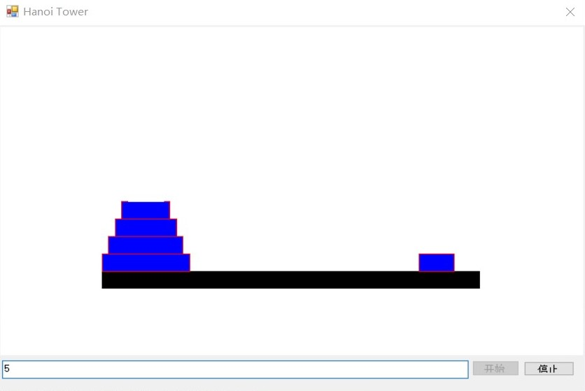

# hanoi-dotnet-graphics
## Introduction
A simple WinForm program that uses the DotNet drawing API to show the process of solving a Hanoi Tower problem, in C# and VB.

This project could be used to demonstrate the use of graphics API in WinForm, and the C#/VB *async/await* syntax. It won't go into nonresponding state due to the use of async.

## Screenshot
